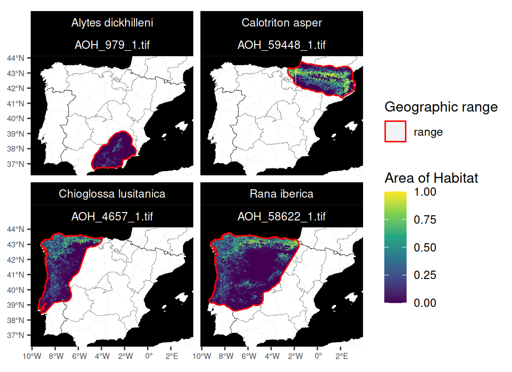

<!--- README.md is generated from README.Rmd. Please edit that file -->

## aoh: Create Area of Habitat Data

[](https://lifecycle.r-lib.org/articles/stages.html)
[](https://github.com/prioritizr/aoh/actions)
[](https://github.com/prioritizr/aoh/actions)
[](https://github.com/prioritizr/aoh/actions)
[](https://codecov.io/github/prioritizr/aoh?branch=master)
[](https://CRAN.R-project.org/package=aoh)

### Overview

Area of Habitat (AOH) maps aim to delineate the spatial distribution of
suitable habitat for a species ([Brooks *et al.*
2019](https://doi.org/10.1016/j.tree.2019.06.009)). They are used to
assess performance of protected area systems, measure impacts of threats
to biodiversity, and identify priorities for conservation actions
(e.g. [Rondinini *et al.*
2005](https://doi.org/10.1111/j.1523-1739.2005.00204.x); [Tracewski *et
al.* 2016](https://doi.org/10.1111/cobi.12715); [Durán *et al.*
2021](https://doi.org/10.1111/2041-210X.13427)). These maps are
generally produced by obtaining geographic range data for a species, and
then removing areas that do not contain suitable habitat or occur
outside the known altitudinal limits for the species ([Brooks *et al.*
2019](https://doi.org/10.1016/j.tree.2019.06.009)). To help make these
maps accessible, the *aoh R* package provides routines for automatically
creating Area of Habitat data based on the [International Union for
Conservation of Nature (IUCN) Red List of Threatened
Species](https://www.iucnredlist.org/). After manually downloading
species range data from the [IUCN Red
List](https://www.iucnredlist.org/resources/spatial-data-download),
users can import these data (using `read_spp_range_data()`) and then use
them to create Area of Habitat data (using `create_spp_aoh_data()`).
Global elevation and habitat classification data ([Amatulli *et al.*
2018](https://doi.org/10.1038/sdata.2018.40); [Jung *et al.*
2020](https://doi.org/10.1038/s41597-020-00599-8)) are automatically
downloaded, and data on species’ habitat preferences and altitudinal
limits are obtained automatically using the [IUCN Red List
API](https://apiv3.iucnredlist.org/). Since accessing the IUCN Red List
requires a token, users may need to [obtain a
token](https://apiv3.iucnredlist.org/api/v3/token) and update their *R*
configuration to recognize the token (see installation instructions
below for details).

### Installation

#### Package installation

The [latest developmental version of the *aoh R*
package](https://github.com/prioritizr/aoh) can be installed using the
following *R* code. Please note that it requires the
[*sf*](https://CRAN.R-project.org/package=sf),
[*terra*](https://CRAN.R-project.org/package=terra), and
[*zen4R*](https://CRAN.R-project.org/package=zen4R) *R* packages, which
may require additional software to be installed. If you encounter
problems installing these dependencies, please consult their
installation instructions.

``` r
if (!require(remotes)) install.packages("remotes")
remotes::install_github("prioritizr/aoh")
```

#### Accessing the IUCN Red List API

After installing the *aoh R* package, you will need to obtain a token
for the [IUCN Red List API](https://apiv3.iucnredlist.org/) (if you do
not have one already). To do so, please visit the IUCN website (see
<https://apiv3.iucnredlist.org/api/v3/token>) and fill out the form to
apply for a token. You should then receive a token shortly after
completing the form (but not immediately). After receiving a token,
please open the `.Renviron` file on your computer (e.g. using
`usethis::edit_r_environ()`). Next, please add the following text to the
file (replacing the string with the token) and save the file, using your
token in place of the string below.

    IUCN_REDLIST_KEY="your_actual_token_not_this_string"

Please restart your R session. You should now be able to access the IUCN
Red List API. To verify this, please try running the following *R* code
and – assuming everything works correctly – you should the same output
below.

``` r
# verify access to IUCN Red List API
is_iucn_rl_api_available()
```

If these instructions did not work, please consult the documentation for
the [*rredlist*](https://CRAN.R-project.org/package=rredlist) *R*
package for further details.

#### Optional system libraries

The package can leverage the [Geospatial Data Abstraction Library
(GDAL)](https://gdal.org/) and [Geographic Resources Analysis Support
System (GRASS)](https://grass.osgeo.org/) to help reduce processing
time. Although use of these software is optional, they can help improve
computational performance when processing data across large spatial
extents. Below we provide platform-specific instructions to install
them.

##### *Windows*

The easiest way to install GDAL and GRASS is through
[OSGeo4W](https://www.osgeo.org/). [Download the OSGeo4W
installer](https://trac.osgeo.org/osgeo4w/), select the “Express
Install” option, and then follow the prompts to complete the
installation. After the installation process has finished, please
restart your computer. If the *gdalUtils R* package cannot find GDAL,
you may also need to update the `PATH` environmental variable so that it
contains the folder path for GDAL (default folder path is
`C:\OSGeo4W\bin`),

##### *Ubuntu*

For recent versions of Ubuntu (18.04 and later), the libraries are
available through official repositories. They can be installed using the
following system commands.

    apt-get -y update
    apt-get install -y gdal-bin grass

##### *Linux*

For Unix-alikes, `gdal` (&gt;= 3.0.2) and `grass` (&gt;= 7.8.5) are
required.

##### *MacOS*

The easiest way to install the libraries is using
[HomeBrew](https://brew.sh/). After installing HomeBrew, the libraries
can be installed using the following system commands.

    brew tap osgeo/osgeo4mac
    brew install pkg-config
    brew install gdal
    brew install osgeo-grass

### Usage

Here we provide a short example for using the *aoh R* package. In this
example, we will generate Area of Habitat data for the following Iberian
species: Pyrenean brook salamander (*Calotriton asper*), Iberian frog
(*Rana iberica*), western spadefoot toad (*Pelobates cultripes*), and
golden striped salamnader (*Chioglossa lusitanica*). Please note that
this example is an abridged version of the tutorial provided in the
[package vignette](https://prioritizr.github.io/aoh/articles/aoh.html),
so please consult the package vignette for a more detailed tutorial on
using the package. To start off, we will load the package and several
other packages to help with data processing and visualization.

``` r
# load packages
library(aoh)
library(terra)
library(rappdirs)
library(ggplot2)
```

Now we will import range data for the species. Although users would
typically obtain range data from the [International Union for
Conservation of Nature (IUCN) Red List of Threatened
Species](https://www.iucnredlist.org/), here we will use built-in
species range data that distributed with the package for convenience.
**Please note that these data were not obtained from the IUCN Red List,
and were manually generated using occurrence records from the [Global
Biodiversity Information Facility](https://www.gbif.org/).**

``` r
# find file path for data
path <- system.file("extdata", "EXAMPLE_SPECIES.zip", package = "aoh")

# import data
spp_range_data <- read_spp_range_data(path)

# preview data
print(spp_range_data)
```

    ## Simple feature collection with 4 features and 26 fields
    ## Geometry type: POLYGON
    ## Dimension:     XY
    ## Bounding box:  xmin: -9.479736 ymin: 36.59422 xmax: 3.302702 ymax: 43.76455
    ## Geodetic CRS:  WGS 84
    ## # A tibble: 4 × 27
    ##   id_no binomial       presence origin seasonal compiler     yrcompiled citation
    ##   <dbl> <chr>             <int>  <int>    <int> <chr>             <dbl> <chr>   
    ## 1   979 Alytes dickhi…        1      1        1 Derived fro…         NA <NA>    
    ## 2 59448 Calotriton as…        1      1        1 Derived fro…         NA <NA>    
    ## 3  4657 Chioglossa lu…        1      1        1 Derived fro…         NA <NA>    
    ## 4 58622 Rana iberica          1      1        1 Derived fro…         NA <NA>    
    ## # … with 19 more variables: subspecies <chr>, subpop <chr>, source <chr>,
    ## #   island <chr>, tax_comm <chr>, dist_comm <chr>, generalisd <int>,
    ## #   legend <chr>, kingdom <chr>, phylum <chr>, class <chr>, order_ <chr>,
    ## #   family <chr>, genus <chr>, category <chr>, marine <chr>, terrestial <chr>,
    ## #   freshwater <chr>, geometry <POLYGON [°]>

Next, we will generate Area of Habitat data for the species. We also
specify a folder to cache the downloaded datasets so that we won’t need
to re-downloaded again during subsequent runs.

``` r
# specify cache directory
cache_dir <- user_data_dir("aoh")

# create cache_dir if needed
if (!file.exists(cache_dir)) {
  dir.create(cache_dir, showWarnings = FALSE, recursive = TRUE)
}

# specify folder to save Area of Habitat data
## although we use a temporary directory here to avoid polluting your
## with examples files, you would normally specify the folder
## on your computer where you want to save data
output_dir <- tempdir()

# generate Area of Habitat data
## note that this function might take a complete because it will need to
## download the global habitat and elevation data that first time you run it.
spp_aoh_data <- create_spp_aoh_data(
  spp_range_data, output_dir = output_dir, cache_dir = cache_dir
)

# preview results
print(spp_aoh_data[, c("id_no", "seasonal", "path")])
```

After generating the Area of Habitat data, we can import them.

``` r
# import the Area of Habitat data
spp_aoh_rasters <- lapply(spp_aoh_data$path, rast)

# preview raster data
print(spp_aoh_rasters)
```

    ## [[1]]
    ## class       : SpatRaster 
    ## dimensions  : 5150, 5360, 1  (nrow, ncol, nlyr)
    ## resolution  : 100, 100  (x, y)
    ## extent      : -914731, -378731, 4551877, 5066877  (xmin, xmax, ymin, ymax)
    ## coord. ref. : World_Behrmann 
    ## source      : AOH_4657_1.tif 
    ## name        : lyr1 
    ## min value   :    0 
    ## max value   :    1 
    ## 
    ## [[2]]
    ## class       : SpatRaster 
    ## dimensions  : 4979, 7512, 1  (nrow, ncol, nlyr)
    ## resolution  : 100, 100  (x, y)
    ## extent      : -904331, -153131, 4568977, 5066877  (xmin, xmax, ymin, ymax)
    ## coord. ref. : World_Behrmann 
    ## source      : AOH_58622_1.tif 
    ## name        : lyr1 
    ## min value   :    0 
    ## max value   :    1 
    ## 
    ## [[3]]
    ## class       : SpatRaster 
    ## dimensions  : 2266, 5671, 1  (nrow, ncol, nlyr)
    ## resolution  : 100, 100  (x, y)
    ## extent      : -248331, 318769, 4838377, 5064977  (xmin, xmax, ymin, ymax)
    ## coord. ref. : World_Behrmann 
    ## source      : AOH_59448_1.tif 
    ## name        : lyr1 
    ## min value   :    0 
    ## max value   :    1 
    ## 
    ## [[4]]
    ## class       : SpatRaster 
    ## dimensions  : 2594, 3701, 1  (nrow, ncol, nlyr)
    ## resolution  : 100, 100  (x, y)
    ## extent      : -468031, -97931, 4364277, 4623677  (xmin, xmax, ymin, ymax)
    ## coord. ref. : World_Behrmann 
    ## source      : AOH_979_1.tif 
    ## name        : lyr1 
    ## min value   :    0 
    ## max value   :    1

Finally, let’s create some maps to compare the range data with the Area
of habitat data.

``` r
# create maps
map <-
  plot_spp_aoh_data(spp_aoh_data, zoom = 6, maptype = "toner-background") +
  scale_fill_viridis_d() +
  scale_color_manual(values = c("range" = "red")) +
  scale_size_manual(values = c("range" = 0.5)) +
  theme(
    axis.title = element_blank(),
    axis.text = element_text(size = 6),
    strip.text = element_text(color = "white"),
    strip.background = element_rect(fill = "black", color = "black")
  )

# display maps
print(map)
```



### Citation

**Please note that the package is still in the early stages of
development and not ready for general use. It is not yet suitable for
use in scientific publications or related work.**

Please cite the *aoh R* package and the underlying datasets used to
produce Area of Habitat data.


    Area of Habitat data are created using a range of different datasets.
    Depending on which datasets are used, please cite the aoh package and
    relevant data using:

      Hanson JO (2021) aoh: Create Area of Habitat Data. R package version
      0.0.0.99999. Available at https://github.com/jeffreyhanson/aoh.

      IUCN [insert year] IUCN Red List of Threatened Species. Version
      [insert version]. Available at www.iucnredlist.org.

      BirdLife International and Handbook of the Birds of the World
      ([insert year]) Bird species distribution maps of the world. Version
      [insert version]. Available at
      http://datazone.birdlife.org/species/requestdis.

      Jung M, Dahal PR, Butchart SHM, Donald PF, De Lamo X, Lesiv M, Kapos
      V, Rondinini C, and Visconti P (2020a) A global map of terrestrial
      habitat types. Scientific data, 7:1--8.

      Jung M, Dahal PR, Butchart SHM, Donald PF, De Lamo X, Lesiv M, Kapos
      V, Rondinini C, and Visconti P (2020b) A global map of terrestrial
      habitat types (insert version) [Data set]. Zenodo. Available at
      https://doi.org/10.5281/zenodo.4058819.

      Robinson N, Regetz J, and Guralnick RP (2014) EarthEnv-DEM90: A
      nearly-global, void-free, multi-scale smoothed, 90m digital elevation
      model from fused ASTER and SRTM data. ISPRS Journal of Photogrammetry
      and Remote Sensing, 87:57--67.

    To see these entries in BibTeX format, use 'print(<citation>,
    bibtex=TRUE)', 'toBibtex(.)', or set
    'options(citation.bibtex.max=999)'.

## Getting help

Please refer to the [package website](https://prioritizr.github.io/aoh)
for more information. If you have any questions about using the package
or suggestions for improving it, please [file an issue at the package’s
online code repository](https://github.com/prioritizr/aoh/issues).
