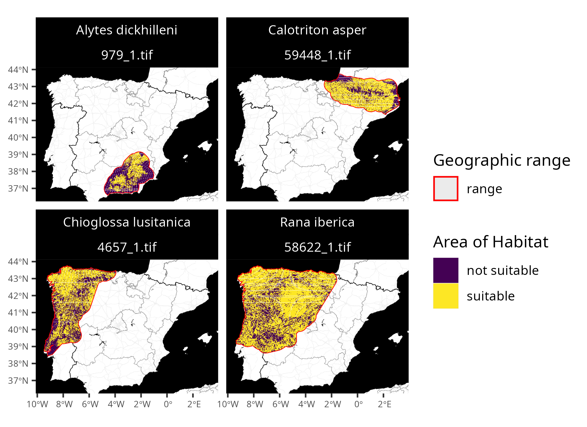

# Getting started

## Introduction

Area of Habitat (AOH) maps aim to delineate the spatial distribution of
suitable habitat for a species (Brooks *et al.* 2019). They are used to
assess performance of protected area systems, measure impacts of threats
to biodiversity, and identify priorities for conservation actions
(Tracewski *et al.* 2016; Rondinini *et al.* 2005; Durán *et al.* 2020).
These maps are generally produced by obtaining geographic range data for
a species, and then removing areas that do not contain suitable habitat
or occur outside the known elevational limits for the species (Brooks
*et al.* 2019). To help make these maps accessible, the *aoh R* package
provides routines for automatically creating Area of Habitat data based
on the [International Union for Conservation of Nature (IUCN) Red List
of Threatened Species](https://www.iucnredlist.org/). After manually
downloading species range data from the [IUCN Red
List](https://www.iucnredlist.org/resources/spatial-data-download),
users can import them (using
[`read_spp_range_data()`](https://prioritizr.github.io/aoh/reference/read_spp_range_data.md)),
prepare them and collate additional information for subsequent
processing (using
[`create_spp_info_data()`](https://prioritizr.github.io/aoh/reference/create_spp_info_data.md)),
and then create Area of Habitat data (using
[`create_spp_aoh_data()`](https://prioritizr.github.io/aoh/reference/create_spp_aoh_data.md)).
Global elevation and habitat classification data are automatically
downloaded (Robinson *et al.* 2014; Jung *et al.* 2020; Lumbierres *et
al.* 2021), and data on species’ habitat preferences and elevational
limits are obtained automatically using the [IUCN Red List
API](https://api.iucnredlist.org/). Since accessing the IUCN Red List
requires a token, users may need to [obtain a
token](https://api.iucnredlist.org/) and update their *R* configuration
to recognize the token (see README for details).

## Tutorial

Here we provide a tutorial for using the *aoh R* package. In this
tutorial, we will generate Area of Habitat data for the following
Iberian species: Pyrenean brook salamander (*Calotriton asper*), Iberian
frog (*Rana iberica*), western spadefoot toad (*Pelobates cultripes*),
and golden striped salamnader (*Chioglossa lusitanica*). To start off,
we will load the package. We will also load the
[*rappdirs*](https://CRAN.R-project.org/package=rappdirs) *R* package to
cache data, and the [*terra*](https://CRAN.R-project.org/package=terra)
and [*ggplot2*](https://CRAN.R-project.org/package=ggplot2) *R* packages
to visualize results.

``` r
# load packages
library(aoh)
library(terra)
library(rappdirs)
library(ggplot2)
```

Now we will import range data for the species. Although users would
typically obtain range data from the [International Union for
Conservation of Nature (IUCN) Red List of Threatened
Species](https://www.iucnredlist.org/), here we will use built-in
species range data that distributed with the package for convenience.
**Please note that these data were not obtained from the IUCN Red List,
and were manually generated using occurrence records from the [Global
Biodiversity Information Facility](https://www.gbif.org/).**

``` r
# find file path for data
path <- system.file("extdata", "EXAMPLE_SPECIES.zip", package = "aoh")

# import data
spp_range_data <- read_spp_range_data(path)

# preview data
print(spp_range_data)
```

    ## Simple feature collection with 4 features and 26 fields
    ## Geometry type: POLYGON
    ## Dimension:     XY
    ## Bounding box:  xmin: -9.479736 ymin: 36.59422 xmax: 3.302702 ymax: 43.76455
    ## Geodetic CRS:  WGS 84
    ## # A tibble: 4 × 27
    ##   id_no binomial           presence origin seasonal compiler yrcompiled citation
    ##   <dbl> <chr>                 <int>  <int>    <int> <chr>         <dbl> <chr>   
    ## 1   979 Alytes dickhilleni        1      1        1 Derived…         NA NA      
    ## 2 59448 Calotriton asper          1      1        1 Derived…         NA NA      
    ## 3  4657 Chioglossa lusita…        1      1        1 Derived…         NA NA      
    ## 4 58622 Rana iberica              1      1        1 Derived…         NA NA      
    ## # ℹ 19 more variables: subspecies <chr>, subpop <chr>, source <chr>,
    ## #   island <chr>, tax_comm <chr>, dist_comm <chr>, generalisd <int>,
    ## #   legend <chr>, kingdom <chr>, phylum <chr>, class <chr>, order_ <chr>,
    ## #   family <chr>, genus <chr>, category <chr>, marine <chr>, terrestial <chr>,
    ## #   freshwater <chr>, geometry <POLYGON [°]>

Next, we will prepare all the range data for generating Area of Habitat
data. This procedure – in addition to repairing any geometry issues in
the spatial data – will obtain information on the species’ habitat
preferences and elevational limits (via the IUCN Red List of Threatened
Species). We also specify a folder to cache the downloaded data so that
we won’t need to re-download it again during subsequent runs.

``` r
# specify cache directory
cache_dir <- user_data_dir("aoh")

# create cache_dir if needed
if (!file.exists(cache_dir)) {
  dir.create(cache_dir, showWarnings = FALSE, recursive = TRUE)
}

# prepare information
spp_info_data <- create_spp_info_data(spp_range_data, cache_dir = cache_dir)
```

We can now generate Area of Habitat data for the species. By default,
these data will be generated using elevation data derived from Robinson
*et al.* (2014) and habitat data derived from Lumbierres *et al.*
(2021). Similar to before, we also specify a folder to cache the
downloaded datasets so that we won’t need to re-downloaded again during
subsequent runs.

``` r
# specify cache directory
cache_dir <- user_data_dir("aoh")

# specify folder to save Area of Habitat data
## although we use a temporary directory here to avoid polluting your computer
## with examples files, you would normally specify the folder
## on your computer where you want to save data
output_dir <- tempdir()

# generate Area of Habitat data
## note that this function might take a complete because it will need to
## download the global habitat and elevation data that first time you run it.
spp_aoh_data <- create_spp_aoh_data(
  spp_info_data, output_dir = output_dir, cache_dir = cache_dir
)
```

While running the code, we see that it displayed a message telling us
that certain habitat classes were not available (i.e., `"7.1"`,
`"7.2"`). **This is fine. It is not an error.** The reason we see this
message is because although the global habitat dataset contains the
majority of [IUCN habitat
classes](https://www.iucnredlist.org/resources/habitat-classification-scheme)
for terrestrial environments, it does not contain every single IUCN
habitat class (see Lumbierres *et al.* 2021 for details). Upon checking
the [IUCN habitat
classes](https://www.iucnredlist.org/resources/habitat-classification-scheme),
we can see that these classes correspond to artificial aquatic areas and
also caves and other subterranean environments. Although failing to
account for such habitats could potentially be an issue, here we will
assume that accounting for the species’ non-subterranean habitats is
sufficient to describe their spatial distribution (Ficetola *et al.*
2014).

``` r
# preview results
## resulting dataset is a simple features (sf) object containing
## spatial geometries for cleaned versions of the range data
## (in the geometry column) and the following additional columns:
##
## - id_no            : IUCN Red List taxon identifier
## - seasonal         : integer identifier for seasonal distributions
## - category         : character IUCN Red List threat category
## - full_habitat_code: All IUCN Red List codes for suitable habitat classes
##                      (multiple codes are delimited using "|" symbols)
## - habitat_code     : IUCN Red List codes for suitable habitat classes
##                      used to create AOH maps
## - elevation_lower  : lower limit for the species on IUCN Red List
## - elevation_upper  : upper limit for the species on IUCN Red List
## - xmin             : minimum x-coordinate for Area of Habitat data
## - xmax             : maximum x-coordinate for Area of Habitat data
## - ymin             : minimum y-coordinate for Area of Habitat data
## - ymax             : maximum y-coordinate for Area of Habitat data
## - path             : file path for Area of Habitat data (GeoTIFF format)
##
## since data obtained from the IUCN Red List cannot be redistributed,
## we will only show some of the columns in this object
##
## N.B., you can view all columns on your computer with:
##> print(spp_aoh_data, width = Inf)
print(spp_aoh_data[, c("id_no", "binomial", "seasonal", "path")])
```

    ## Simple feature collection with 4 features and 4 fields
    ## Geometry type: POLYGON
    ## Dimension:     XY
    ## Bounding box:  xmin: -914664.9 ymin: 4364387 xmax: 318665.2 ymax: 5066721
    ## Projected CRS: World_Behrmann
    ## # A tibble: 4 × 5
    ##   id_no binomial              seasonal path                             geometry
    ##   <dbl> <chr>                    <int> <chr>                       <POLYGON [m]>
    ## 1   979 Alytes dickhilleni           1 /tmp/Rtmp3yZoO… ((-105506.8 4465112, -10…
    ## 2 59448 Calotriton asper             1 /tmp/Rtmp3yZoO… ((-238681 5029057, -2377…
    ## 3  4657 Chioglossa lusitanica        1 /tmp/Rtmp3yZoO… ((-859201.6 4559278, -85…
    ## 4 58622 Rana iberica                 1 /tmp/Rtmp3yZoO… ((-849801.9 4614149, -84…

After generating the Area of Habitat data, we can import them.

``` r
# import the Area of Habitat data
## since the data for each species have a different spatial extent
## (to reduce file sizes), we will import each dataset separately in a list
spp_aoh_rasters <- lapply(spp_aoh_data$path, rast)

# preview raster data
print(spp_aoh_rasters)
```

    ## [[1]]
    ## class       : SpatRaster 
    ## size        : 2593, 3701, 1  (nrow, ncol, nlyr)
    ## resolution  : 100, 100  (x, y)
    ## extent      : -467931, -97831, 4364377, 4623677  (xmin, xmax, ymin, ymax)
    ## coord. ref. : World_Behrmann 
    ## source      : 979_1.tif 
    ## name        : lyr1 
    ## min value   :    0 
    ## max value   :    1 
    ## 
    ## [[2]]
    ## class       : SpatRaster 
    ## size        : 2266, 5670, 1  (nrow, ncol, nlyr)
    ## resolution  : 100, 100  (x, y)
    ## extent      : -248331, 318669, 4838277, 5064877  (xmin, xmax, ymin, ymax)
    ## coord. ref. : World_Behrmann 
    ## source      : 59448_1.tif 
    ## name        : lyr1 
    ## min value   :    0 
    ## max value   :    1 
    ## 
    ## [[3]]
    ## class       : SpatRaster 
    ## size        : 5149, 5361, 1  (nrow, ncol, nlyr)
    ## resolution  : 100, 100  (x, y)
    ## extent      : -914731, -378631, 4551877, 5066777  (xmin, xmax, ymin, ymax)
    ## coord. ref. : World_Behrmann 
    ## source      : 4657_1.tif 
    ## name        : lyr1 
    ## min value   :    0 
    ## max value   :    1 
    ## 
    ## [[4]]
    ## class       : SpatRaster 
    ## size        : 4978, 7512, 1  (nrow, ncol, nlyr)
    ## resolution  : 100, 100  (x, y)
    ## extent      : -904331, -153131, 4568977, 5066777  (xmin, xmax, ymin, ymax)
    ## coord. ref. : World_Behrmann 
    ## source      : 58622_1.tif 
    ## name        : lyr1 
    ## min value   :    0 
    ## max value   :    1

We can see that the Area of Habitat data for each species are stored in
separate spatial (raster) datasets with different extents. Although this
is useful because it drastically reduces the total size of the data for
each species, it can make it difficult to work with data for multiple
species. To address this, we can use the
[`terra_combine()`](https://prioritizr.github.io/aoh/reference/terra_combine.md)
function to automatically align and combine the spatial data for all
species’ distributions into a single spatial dataset.

``` r
# combine raster data
spp_aoh_rasters <- terra_combine(spp_aoh_rasters)

# assign identifiers to layer names
names(spp_aoh_rasters) <- paste0(
  "AOH_", spp_aoh_data$id_no, "_", spp_aoh_data$seasonal
)

# preview raster data
print(spp_aoh_rasters)
```

    ## class       : SpatRaster 
    ## size        : 7024, 12334, 4  (nrow, ncol, nlyr)
    ## resolution  : 100, 100  (x, y)
    ## extent      : -914731, 318669, 4364377, 5066777  (xmin, xmax, ymin, ymax)
    ## coord. ref. : World_Behrmann 
    ## source(s)   : memory
    ## varnames    : 979_1 
    ##               59448_1 
    ##               4657_1 
    ##               ...
    ## names       : AOH_979_1, AOH_59448_1, AOH_4657_1, AOH_58622_1 
    ## min values  :         0,           0,          0,           0 
    ## max values  :         1,           1,          1,           1

Finally, let’s create some maps to compare the range data with the Area
of habitat data. Although we could create these maps manually (e.g.,
using the [*ggplot2*](https://CRAN.R-project.org/package=ggplot2) *R*
package), we will use a plotting function distributed with the *aoh R*
package for convenience.

``` r
# create maps
## N.B. you might need to install the ggmap package to create the maps
map <-
  plot_spp_aoh_data(
    spp_aoh_data,
    zoom = 6,
    maptype = "stamen_toner_background"
  ) +
  scale_fill_viridis_d() +
  scale_color_manual(values = c("range" = "red")) +
  scale_size_manual(values = c("range" = 0.5)) +
  theme(
    axis.title = element_blank(),
    axis.text = element_text(size = 6),
    strip.text = element_text(color = "white"),
    strip.background = element_rect(fill = "black", color = "black")
  )

# display maps
print(map)
```



## Frequently asked questions

Here we provide answers to some of the frequently asked questions
encountered when using the package.

- **I see the following error message
  `Error : need an API key for Red List data`, how do I resolve this?**

  This error message indicates that you need to obtain a token to access
  the [IUCN Red List API](https://api.iucnredlist.org/), or that you
  need to complete the setup process so that R can use the token. For
  further details on resolving this issue, please see below for details
  on obtaining access to the IUCN Red List API. If you have previously
  completed the set up procedures and still receive this error message,
  please try completing them again.

- **How do I obtain access to the IUCN Red List API?**

  You will need to obtain a token to access the [IUCN Red List
  API](https://api.iucnredlist.org/) (if you do not have one already).
  To achieve this, please visit the IUCN API website
  (<https://api.iucnredlist.org/>), click the “Generate a token” link at
  the top of the web page, and fill out the form to apply for a token.
  You should then receive a token shortly after completing the form (but
  not immediately). After receiving a token, you will need to complete
  some additional steps so that R can use this token to access the IUCN
  Red List API.

  Please open the `.Renviron` file on your computer (e.g., using
  [`usethis::edit_r_environ()`](https://usethis.r-lib.org/reference/edit.html)).
  Next, please add the following text to the file (replacing the string
  with the token) and save the file:

      IUCN_REDLIST_KEY="your_actual_token_not_this_string"

  Please restart your R session. You should now be able to access the
  IUCN Red List API. To verify this, please try running the following
  *R* code and – assuming everything works correctly – you should see
  the current version of the IUCN Red List:

  ``` r
  # verify access to IUCN Red List API
  rredlist::rl_version()
  ```

  If these instructions did not work, please consult the documentation
  for the [*rredlist*](https://CRAN.R-project.org/package=rredlist) *R*
  package for further details.

- **Where can I find species range data for generating Area of Habitat
  data?**

  Species range data can be obtained from the [IUCN Red
  List](https://www.iucnredlist.org/) (see [Spatial Data Download
  resources](https://www.iucnredlist.org/resources/spatial-data-download)).
  They can also be obtained from other data sources (see the question
  below for details).

- **I keep seeing this message
  `Error in x$.self$finalize() : attempt to apply non-function`, what
  does it mean?**

  This message is commonly encountered when using the *terra* package
  with large datasets. Although there is currently no known solution to
  prevent this message from appearing, the message can be safely ignored
  ([see here for details](https://github.com/rspatial/terra/issues/30)).
  This is because the message does not stop R from completing spatial
  data processing – meaning that R will continue processing data even
  when this message is displayed – and the underlying cause of the
  message is not thought to result in incorrect calculations.

- **Can I produce Area of Habitat data for thousands of species
  globally?**

  Yes, the package can generate Area of Habitat data for all terrestrial
  amphibians, mammals, birds, and reptiles. To accomplish this, you will
  need a system with at least 16 Gb RAM and 65 Gb disk space. The
  processing could take a couple of days (e.g., if processing all
  amphibian species) or weeks (e.g., if processing all bird species) to
  complete. An example script for processing global data is available on
  the online code repository ([see
  here](https://github.com/prioritizr/aoh/tree/master/inst/examples)).
  Additionally, since a lot of memory is required to process data for
  all bird species globally, it is recommended to split the full dataset
  containing all bird species into multiple chunks (e.g., six chunks)
  and process each of these chunks separately.

- **How can I speed up the processing for Area of Habitat data?**

  The
  [`create_spp_aoh_data()`](https://prioritizr.github.io/aoh/reference/create_spp_aoh_data.md)
  function can use different software engines for data processing
  (specified via the `engine` parameter). Although each engine produces
  the same results, some engines are more computationally efficient than
  others. The default `"terra"` engine uses the *terra* package for
  processing. Although this engine is easy to install and fast for small
  datasets, it does not scale well for larger datasets. It is generally
  recommended to use the `"gdal"` engine in all cases where possible.
  Although the `"gdal"` engine requires installation of additional
  software (see the package README for instructions), it is much faster
  than the other engines. Additionally, the `"grass"` engine is also
  available. This engine can be faster than the `"terra"` engine when
  processing many species across large spatial extents. However,
  benchmarks indicate that it is slower than the `"gdal"` engine.

- **Can I use species range data from other data sources (instead of the
  IUCN Red List)?**

  Yes, you can use species range data from a variety of sources. For
  example, species range data could be obtained from governmental (e.g.,
  data for federally listed species in Canada are available through the
  [Government of Canada data
  portal](http://open.canada.ca/en/using-open-data)) and
  non-governmental organizations (e.g., [Botanical Information and
  Ecology Network](https://biendata.org/) and [Map of
  Life](https://mol.org/)). These data can also be produced using
  observation records (e.g., following Palacio *et al.* 2021) from data
  repositories (e.g., [Global Biodiversity Information
  Facility](https://www.gbif.org/) and [Atlas of Living
  Australia](https://www.ala.org.au/)). After obtaining species range
  data, they will need to be formatted so that they follow the data
  format conventions used by the IUCN Red List. This means that the
  species range data must contain the following columns: `id_no`,
  `presence`, `origin`, `seasonal`, `terrestrial` (or `terrestial`),
  `freshwater`, and `marine`. For further details on what values these
  columns should contain, please see the **Species range data format**
  section in the documentation for
  [`create_spp_info_data()`](https://prioritizr.github.io/aoh/reference/create_spp_info_data.md)
  and the [IUCN Red List
  documentation](https://www.iucnredlist.org/resources/mappingstandards).
  Additionally, note that if you wish to use the IUCN Red List for
  specifying habitat preference data, please ensure that the `id_no`
  specified for each species follows the taxon identifiers used by the
  IUCN Red List. For example, the tutorial used manually generated
  species range data for the Pyrenean brook salamander (*Calotriton
  asper*). To ensure that correct habitat preference data were obtained
  for this species from the the IUCN Red List, the `id_no` value
  specified for this species was specified as `59448`.

- **Can I use species elevational limit data from other sources?**

  Yes, you can use elevational limit data from other sources. For
  example, for birds it is important to use the “Occasional minimum
  altitude” and “Occasional maximum altitude” estimates for those
  species for which these are coded in the IUCN Red List. These data are
  available on request from BirdLife International (see
  <https://datazone.birdlife.org/contact-us/request-our-data>). To use
  such data, you will need to manually create a table containing the
  species’ summary information. This table will need to contain
  information on the species’ elevational limits, as well as their
  habitat preferences and threat status (see
  [`get_spp_summary_data()`](https://prioritizr.github.io/aoh/reference/get_spp_summary_data.md)
  for the correct format). After preparing these data, they can be used
  to collate the information needed for processing Area of Habitat data
  (via
  [`create_spp_info_data()`](https://prioritizr.github.io/aoh/reference/create_spp_info_data.md))
  and, in turn, create Area of Habitat data (via
  `create_spp_aoh_data())`.

- **Can I use elevation data from other data sources?**

  Yes, you can use elevation data from a variety of sources. For
  example, elevation data could be derived from [NASA’s Shuttle Radar
  Topography Mission
  (SRTM)](https://csidotinfo.wordpress.com/data/srtm-90m-digital-elevation-database-v4-1/).
  After preparing the elevation data, they can be used to create Area of
  Habitat data (via
  [`create_spp_aoh_data()`](https://prioritizr.github.io/aoh/reference/create_spp_aoh_data.md)).
  For more information, see the [Customization
  vignette](https://prioritizr.github.io/aoh/articles/customization.md).

- **Can I use habitat classification data from other data sources?**

  Yes, you can use habitat classification data from a variety of
  sources. For example, the habitat classification data could be derived
  from [Copernicus Corine Land
  Cover](https://land.copernicus.eu/en/products/corine-land-cover), and
  [MODIS Land Cover data
  (MCD12Q1)](https://www.earthdata.nasa.gov/data/catalog/lpcloud-mcd12q1-061).
  To use such data, you will also need to develop a crosswalk table to
  specify which land cover (or habitat) classes correspond to which
  habitat classes as defined by the [IUCN Red List Habitat
  Classification
  Scheme](https://www.iucnredlist.org/resources/habitat-classification-scheme)
  (e.g., see Tracewski *et al.* 2016; Lumbierres *et al.* 2021). After
  preparing the habitat classification data and the crosswalk table,
  they can be used to create Area of Habitat data (via
  [`create_spp_aoh_data()`](https://prioritizr.github.io/aoh/reference/create_spp_aoh_data.md)).
  For more information, see the [Customization
  vignette](https://prioritizr.github.io/aoh/articles/customization.md).

- **The output Area of Habitat data have different spatial extents, how
  can I combine them together?**

  The
  [`terra_combine()`](https://prioritizr.github.io/aoh/reference/terra_combine.md)
  function can be used to align and combine a `list` of raster
  [`terra::rast()`](https://rspatial.github.io/terra/reference/rast.html)
  objects into a single object. Note that this procedure is only
  recommended when all species occur in the same geographic region.
  Please see the tutorial above for an example of using this function to
  combine Area of Habitat data for multiple species into a single
  object.

## Conclusion

Hopefully, this vignette has provided a useful introduction to the
package. If you encounter any issues when running the code in this
tutorial – or when adapting the code for your own work – please see the
following section. Additionally, if you have any questions about using
the package or suggestions for improving it, please [file an issue at
the package’s online code
repository](https://github.com/prioritizr/aoh/issues).

## References

Brooks, T.M., Pimm, S.L., Akçakaya, H.R., Buchanan, G.M., Butchart,
S.H.M., Foden, W., Hilton-Taylor, C., Hoffmann, M., Jenkins, C.N.,
Joppa, L., Li, B.V., Menon, V., Ocampo-Peñuela, N. & Rondinini, C.
(2019). [Measuring terrestrial area of habitat (AOH) and its utility for
the IUCN red list](https://doi.org/10.1016/j.tree.2019.06.009). *Trends
in Ecology and Evolution*, *34*, 977–986.

Durán, A.P., Green, J.M.H., West, C.D., Visconti, P., Burgess, N.D.,
Virah-Sawmy, M. & Balmford, A. (2020). A practical approach to measuring
the biodiversity impacts of land conversion. *Methods in Ecology and
Evolution*, *11*, 910–921.

Ficetola, G.F., Rondinini, C., Bonardi, A., Baisero, D. &
Padoa-Schioppa, E. (2014). [Habitat availability for amphibians and
extinction threat: A global analysis](https://doi.org/10.1111/ddi.12296)
(D. Richardson, Ed.). *Diversity and Distributions*, *21*, 302–311.

Jung, M., Dahal, P.R., Butchart, S.H.M., Donald, P.F., Lamo, X.D.,
Lesiv, M., Kapos, V., Rondinini, C. & Visconti, P. (2020). [A global map
of terrestrial habitat
types](https://doi.org/10.1038/s41597-020-00599-8). *Scientific Data*,
*7*, 256.

Lumbierres, M., Dahal, P.R., Marco, M.D., Butchart, S.H.M., Donald, P.F.
& Rondinini, C. (2021). [Translating habitat class to land cover to map
area of habitat of terrestrial
vertebrates](https://doi.org/10.1111/cobi.13851). *Conservation
Biology*, *36*, e13851.

Palacio, R.D., Negret, P.J., Velásquez-Tibatá, J. & Jacobson, A.P.
(2021). A data-driven geospatial workflow to map species distributions
for conservation assessments. *Diversity and Distributions*, *27*,
2559–2570.

Robinson, N., Regetz, J. & Guralnick, R.P. (2014). [EarthEnv-DEM90: A
nearly-global, void-free, multi-scale smoothed, 90m digital elevation
model from fused ASTER and SRTM
data](https://doi.org/10.1016/j.isprsjprs.2013.11.002). *ISPRS Journal
of Photogrammetry and Remote Sensing*, *87*, 57–67.

Rondinini, C., Stuart, S. & Boitani, L. (2005). [Habitat suitability
models and the shortfall in conservation planning for African
vertebrates](https://doi.org/10.1111/j.1523-1739.2005.00204.x).
*Conservation Biology*, *19*, 1488–1497.

Tracewski, Łukasz, Butchart, S.H.M., Marco, M.D., Ficetola, G.F.,
Rondinini, C., Symes, A., Wheatley, H., Beresford, A.E. & Buchanan, G.M.
(2016). [Toward quantification of the impact of 21st-century
deforestation on the extinction risk of terrestrial
vertebrates](https://doi.org/10.1111/cobi.12715). *Conservation
Biology*, *30*, 1070–1079.
