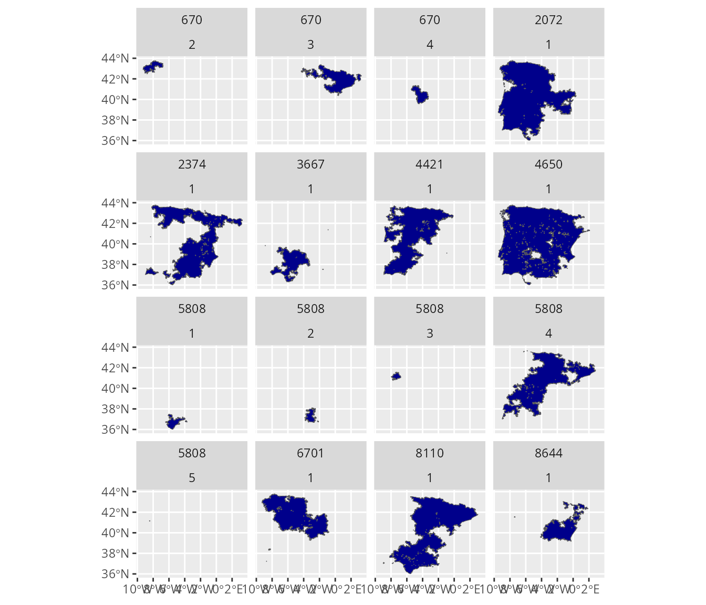
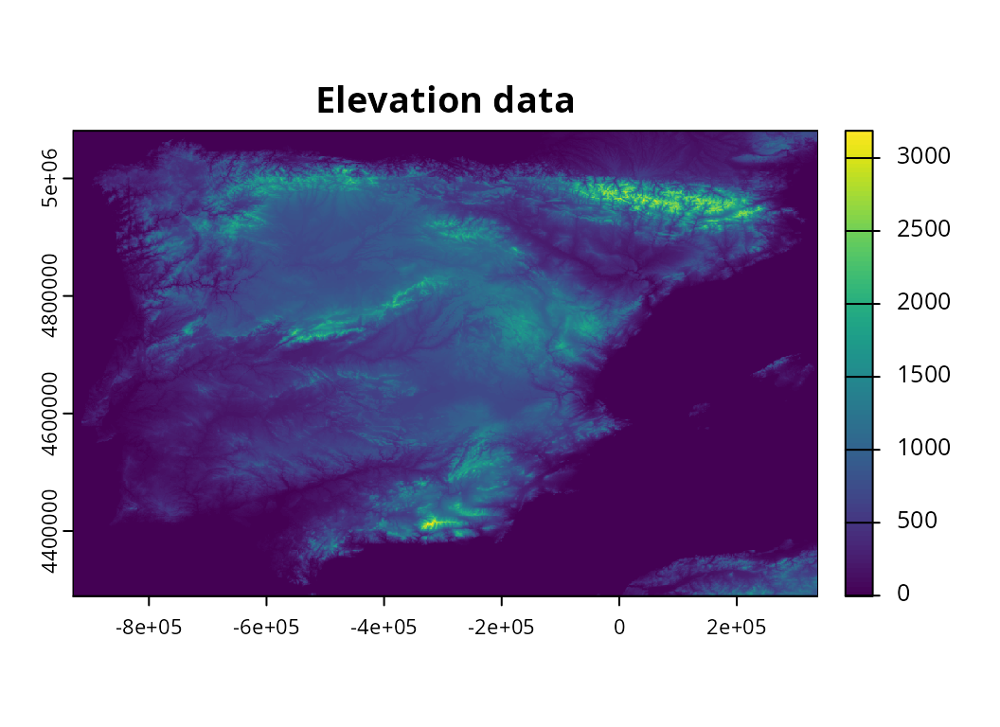
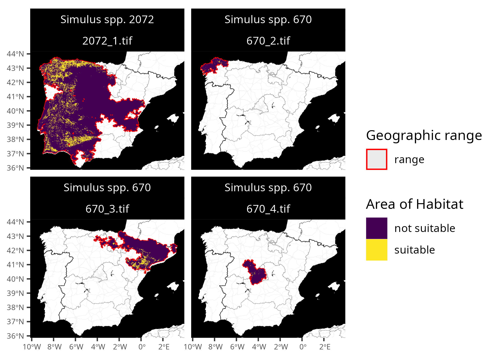

# Customization

## Introduction

The *aoh R* package provides a flexible framework for generating Area of
Habitat data. By default, it will use elevation data derived from
Robinson *et al.* (2014) and habitat classification data derived from
Lumbierres *et al.* (2021). Its defaults also include using species’
elevational limit and habitat preference data from the [International
Union for Conservation of Nature (IUCN) Red List of Threatened
Species](https://www.iucnredlist.org/). In addition to these defaults,
it provides built-in functions to use habitat classification derived
from other data sources (e.g., from Jung *et al.* 2020). The package can
also be used to generate Area of Habitat data using other datasets that
have been manually created by the user. For example, it could be used to
produce Area of Habitat data using habitat classification data derived
from [Copernicus Corine Land
Cover](https://land.copernicus.eu/en/products/corine-land-cover) data or
species’ elevational limit data from the [BirdLife Data
Zone](https://datazone.birdlife.org/home).

## Tutorial

Here we will show how Area of Habitat data can be generated using
particular datasets (rather than the default datasets). In this
tutorial, we will manually import data and use them to generate Area of
Habitat data. If you have not previously read through the [Getting
started vignette](https://prioritizr.github.io/aoh/articles/aoh.md),
this is strongly recommended to provide an introduction to the package.
To start off, we will load the package. We will also load the
[*rappdirs*](https://CRAN.R-project.org/package=rappdirs) package to
cache data, the [tibble](https://CRAN.R-project.org/package=tibble)
package for storing tabular data, and the
[*terra*](https://CRAN.R-project.org/package=terra) and
[*ggplot2*](https://CRAN.R-project.org/package=ggplot2) *R* packages to
visualize results.

``` r
# load packages
library(aoh)
library(terra)
library(tibble)
library(rappdirs)
library(ggplot2)
```

Now we will import geographic range data for the species. Although users
would typically obtain such data from the [IUCN Red
List](https://www.iucnredlist.org/), here we will import example data
distributed with the package. **Please note that these data were not
obtained from the IUCN Red List, and were generated using random
simulations.**

``` r
# find file path for data
spp_range_path <- system.file(
  "testdata", "SIMULATED_SPECIES.zip", package = "aoh"
)

# import data
spp_range_data <- read_spp_range_data(spp_range_path)

# preview data
## dataset follows the same format as the IUCN Red List spatial data
print(spp_range_data)
```

    ## Simple feature collection with 34 features and 26 fields
    ## Geometry type: MULTIPOLYGON
    ## Dimension:     XY
    ## Bounding box:  xmin: -9.497 ymin: 36.01108 xmax: 3.318 ymax: 43.793
    ## Geodetic CRS:  WGS 84
    ## # A tibble: 34 × 27
    ##    id_no seasonal presence origin binomial          compiler yrcompiled citation
    ##    <int>    <dbl>    <dbl>  <dbl> <chr>             <chr>         <dbl> <chr>   
    ##  1   670        2        1      1 Simulus spp. 670  Simulat…         NA NA      
    ##  2   670        3        1      1 Simulus spp. 670  Simulat…         NA NA      
    ##  3   670        4        1      1 Simulus spp. 670  Simulat…         NA NA      
    ##  4  2072        1        1      1 Simulus spp. 2072 Simulat…         NA NA      
    ##  5  2072        1        4      4 Simulus spp. 2072 Simulat…         NA NA      
    ##  6  2072        1        3      3 Simulus spp. 2072 Simulat…         NA NA      
    ##  7  2072        1        3      5 Simulus spp. 2072 Simulat…         NA NA      
    ##  8  2374        1        1      1 Simulus spp. 2374 Simulat…         NA NA      
    ##  9  2374        1        4      2 Simulus spp. 2374 Simulat…         NA NA      
    ## 10  2374        1        5      2 Simulus spp. 2374 Simulat…         NA NA      
    ## # ℹ 24 more rows
    ## # ℹ 19 more variables: subspecies <chr>, subpop <chr>, source <chr>,
    ## #   island <chr>, tax_comm <chr>, dist_comm <chr>, generalisd <int>,
    ## #   legend <chr>, kingdom <chr>, phylum <chr>, class <chr>, order_ <chr>,
    ## #   family <chr>, genus <chr>, category <chr>, marine <chr>, terrestial <chr>,
    ## #   freshwater <chr>, geometry <MULTIPOLYGON [°]>

``` r
# visualize data
## each panel corresponds to a different seasonal distribution of a species
map <-
  ggplot() +
  geom_sf(data = spp_range_data, fill = "darkblue") +
  facet_wrap(~ id_no + seasonal)
print(map)
```



Next, we will import data to describe the species’ habitat preferences.
Although such data would be automatically obtained from the [IUCN Red
List](https://www.iucnredlist.org/) by default (using the
[`get_spp_habitat_data()`](https://prioritizr.github.io/aoh/reference/get_spp_habitat_data.md)
function), here we will import example data distributed with the
package. **As before, please note that these data were not obtained from
the IUCN Red List, and were randomly generated.** If you wish to use
your own data, please ensure that they follow exactly the same
conventions (e.g., column names, data types, and `character` values for
the `"suitability"` and `"season"` columns).

``` r
# find file path for species habitat preference data
spp_habitat_path <- system.file(
  "testdata", "sim_spp_habitat_data.csv", package = "aoh"
)

# import species habitat preference data
spp_habitat_data <- read.csv(spp_habitat_path, sep = ",", header = TRUE)
spp_habitat_data <- as_tibble(spp_habitat_data)

# preview data
print(spp_habitat_data, n = Inf)
```

    ## # A tibble: 42 × 6
    ##    id_no  code habitat                        suitability season majorimportance
    ##    <int> <dbl> <chr>                          <chr>       <chr>  <lgl>          
    ##  1   670  14.5 Urban Areas                    Suitable    Breed… NA             
    ##  2   670  14.2 Pastureland                    Suitable    Breed… NA             
    ##  3   670   4.4 Grassland - Temperate          Suitable    Non-b… NA             
    ##  4   670   3.5 Shrubland - Subtropical/tropi… Suitable    Non-b… NA             
    ##  5   670   6   Rocky Areas (e.g., inland cli… Suitable    Non-b… NA             
    ##  6   670   1.5 Forest - Subtropical/tropical… Suitable    Passa… NA             
    ##  7   670   3.8 Shrubland - Mediterranean-typ… Suitable    Passa… NA             
    ##  8   670   3.4 Shrubland - Temperate          Suitable    Passa… NA             
    ##  9  2072   3.8 Shrubland - Mediterranean-typ… Suitable    Resid… NA             
    ## 10  2072   1.4 Forest - Temperate             Suitable    Resid… NA             
    ## 11  2072   2.1 Savanna - Dry                  Suitable    Resid… NA             
    ## 12  2374   4.4 Grassland - Temperate          Suitable    Resid… NA             
    ## 13  2374   2.1 Savanna - Dry                  Suitable    Resid… NA             
    ## 14  2374  14.5 Urban Areas                    Suitable    Resid… NA             
    ## 15  3667   1.4 Forest - Temperate             Suitable    Resid… NA             
    ## 16  3667   3.5 Shrubland - Subtropical/tropi… Suitable    Resid… NA             
    ## 17  3667   3.8 Shrubland - Mediterranean-typ… Suitable    Resid… NA             
    ## 18  4421   3.5 Shrubland - Subtropical/tropi… Suitable    Resid… NA             
    ## 19  4421   4.4 Grassland - Temperate          Suitable    Resid… NA             
    ## 20  4650   3.8 Shrubland - Mediterranean-typ… Suitable    Resid… NA             
    ## 21  4650   4.4 Grassland - Temperate          Suitable    Resid… NA             
    ## 22  4650  14.5 Urban Areas                    Suitable    Resid… NA             
    ## 23  5808  14.5 Urban Areas                    Suitable    Resid… NA             
    ## 24  5808  14.1 Arable Land                    Suitable    Resid… NA             
    ## 25  5808  14.2 Pastureland                    Suitable    Resid… NA             
    ## 26  5808   3.8 Shrubland - Mediterranean-typ… Suitable    Breed… NA             
    ## 27  5808   4.1 Grassland - Tundra             Suitable    Breed… NA             
    ## 28  5808   2.1 Savanna - Dry                  Suitable    Breed… NA             
    ## 29  5808  14.1 Arable Land                    Suitable    Non-b… NA             
    ## 30  5808   5.5 Wetlands (inland) - Permanent… Suitable    Non-b… NA             
    ## 31  5808   3.8 Shrubland - Mediterranean-typ… Suitable    Passa… NA             
    ## 32  5808   5.5 Wetlands (inland) - Permanent… Suitable    Passa… NA             
    ## 33  5808   4   Grassland                      Suitable    Passa… NA             
    ## 34  6701   3.8 Shrubland - Mediterranean-typ… Suitable    Resid… NA             
    ## 35  6701   5.5 Wetlands (inland) - Permanent… Suitable    Resid… NA             
    ## 36  6701   4.1 Grassland - Tundra             Suitable    Resid… NA             
    ## 37  8110   3.8 Shrubland - Mediterranean-typ… Suitable    Resid… NA             
    ## 38  8110   1.4 Forest - Temperate             Suitable    Resid… NA             
    ## 39  8110  14.5 Urban Areas                    Suitable    Resid… NA             
    ## 40  8644   3.4 Shrubland - Temperate          Suitable    Resid… NA             
    ## 41  8644  14.5 Urban Areas                    Suitable    Resid… NA             
    ## 42  8644   5   Wetlands (inland)              Suitable    Resid… NA

Next, we will import data to describe the species’ elevational limits.
Although such data would be automatically obtained from the [IUCN Red
List](https://www.iucnredlist.org/) by default (using the
[`get_spp_summary_data()`](https://prioritizr.github.io/aoh/reference/get_spp_summary_data.md)
function), here we will import example data distributed with the
package. **As before, please note that these data were not obtained from
the IUCN Red List, and were randomly generated.** Since the dataset
contains additional columns that aren’t strictly necessary, we will also
update it to include only necessary columns. If you wish to use your own
data, please ensure that they follow the same conventions (e.g., column
names, data types).

``` r
# find file path for species habitat preference data
spp_summary_path <- system.file(
  "testdata", "sim_spp_summary_data.csv", package = "aoh"
)

# import species habitat preference data
spp_summary_data <- read.csv(spp_summary_path, sep = ",", header = TRUE)
spp_summary_data <- as_tibble(spp_summary_data)

# extract only necessary columns
col_names <- c("id_no", "elevation_lower", "elevation_upper", "category")
spp_summary_data <- spp_summary_data[, col_names, drop = FALSE]

# preview data
print(spp_summary_data, n = Inf)
```

    ## # A tibble: 10 × 4
    ##    id_no elevation_lower elevation_upper category
    ##    <int>           <int>           <int> <chr>   
    ##  1   670              82             942 LC      
    ##  2  2072              46             907 NT      
    ##  3  2374              65            1019 VU      
    ##  4  3667              15             598 EN      
    ##  5  4421              85             949 VU      
    ##  6  4650              54             951 NT      
    ##  7  5808              91             974 VU      
    ##  8  6701             221            1069 EN      
    ##  9  8110              75             991 VU      
    ## 10  8644             182            1183 LC

After importing all the datasets with the species data, it is important
to ensure that each and every species is associated with geographic
range, habitat preference, and summary data. Here, the `"id_no"` column
values are used to denote different taxa—meaning that each species
should have a unique identifier. These identifiers are used when
cross-referencing the datasets. For example, the species named
`"Simulus spp. 670"` has an identifier (`"id_no"` value) of `670`, and
this identifier is used to denote its range in the `spp_range_data`
dataset, its habitat preferences in the `spp_habitat_data` dataset, and
its elevational limits in the `spp_summary_data` dataset. We can verify
that each of the species have the required information across all three
datasets using the following code.

``` r
# verify all identifiers in range data are present in habitat preference data
## if we see TRUE: then this means both datasets have the same taxa identifiers
## if we see FALSE: then some taxa identifiers are missing from one dataset
setequal(spp_range_data$id_no, spp_habitat_data$id_no)
```

    ## [1] TRUE

``` r
# verify all identifiers in range data are present in summary data
## if we see TRUE: then this means both datasets have the same taxa identifiers
## if we see FALSE: then some taxa identifiers are missing from one dataset
setequal(spp_range_data$id_no, spp_summary_data$id_no)
```

    ## [1] TRUE

We will now import elevation data. Although such data would be
automatically imported by default (using the
[`get_global_elevation_data()`](https://prioritizr.github.io/aoh/reference/get_global_elevation_data.md)
function), here we will import example data distributed with the
package.

``` r
# find file path for elevation data
elevation_path <- system.file(
  "testdata", "sim_elevation_data.tif", package = "aoh"
)

# import elevation data
elevation_data <- rast(elevation_path)

# preview data
print(elevation_data)
```

    ## class       : SpatRaster 
    ## size        : 792, 1268, 1  (nrow, ncol, nlyr)
    ## resolution  : 1000, 1000  (x, y)
    ## extent      : -929631, 338369, 4289077, 5081077  (xmin, xmax, ymin, ymax)
    ## coord. ref. : World_Behrmann 
    ## source      : sim_elevation_data.tif 
    ## name        : dem-100m-esri54017 
    ## min value   :                 -4 
    ## max value   :               3260

``` r
# visualize data
plot(elevation_data, main = "Elevation data")
```



Next, we will import habitat classification data. Although such data
would be automatically imported by default (using the
[`get_lumb_cgls_habitat_data()`](https://prioritizr.github.io/aoh/reference/get_lumb_cgls_habitat_data.md)
function), here we will import example data distributed with the
package.

``` r
# find file path for elevation data
habitat_path <- system.file(
  "testdata", "sim_habitat_data.tif", package = "aoh"
)

# import habitat classification data
habitat_data <- rast(habitat_path)

# preview data
print(habitat_data)
```

    ## class       : SpatRaster 
    ## size        : 792, 1268, 1  (nrow, ncol, nlyr)
    ## resolution  : 1000, 1000  (x, y)
    ## extent      : -929631, 338369, 4289077, 5081077  (xmin, xmax, ymin, ymax)
    ## coord. ref. : World_Behrmann 
    ## source      : sim_habitat_data.tif 
    ## name        : jung-lvl2-10-5281_zenodo-4058819 
    ## min value   :                              104 
    ## max value   :                             1405

``` r
# visualize data
plot(habitat_data, main = "Habitat classification data")
```


Critically, the elevation data and habitat classification data must have
exactly the same spatial properties. This means they must have the same
coordinate reference system, resolution, and spatial extent. If you are
using elevation or habitat classification data that you have previously
prepared yourself (or manually download from online sources), you may
need to resample (or reproject) your data to ensure both datasets have
the same spatial properties using a geographic information system (GIS).
For example, data could be resampled using ESRI ArcGIS, QGIS, [terra R
package](https://cran.r-project.org/package=terra), or the
[gdalUtilities R
package](https://cran.r-project.org/package=gdalUtilities). We can
verify that both of the elevation and habitat classification datasets
have the same spatial properties using the following code.

``` r
# verify that elevation and habitat classification data have same properties
## if we see TRUE, this means they have the same spatial properties.
## otherwise, if we see an error, then this means that they do not have
## have the same spatial properties and require updating
compareGeom(elevation_data, habitat_data)
```

    ## [1] TRUE

We will now import a crosswalk table for the habitat classification
data. A crosswalk table specifies which pixel values in the habitat
classification data correspond to which [IUCN habitat
classes](https://www.iucnredlist.org/resources/habitat-classification-scheme).
This table can specify one-to-one relationships (e.g., pixel value 12
corresponds to IUCN class 1.1), one-to-many relationships (e.g., pixel
values 12 corresponds to IUCN classes 1.1 and 1.2), and many-to-many
relationships (e.g., both pixel values 12 and 13 each correspond to IUCN
classes 1.1 and 1.2). Although such data would be automatically imported
by default (i.e., the `crosswalk_lumb_cgls_data` built-in dataset), here
we will import example data distributed with the package. When using
your own habitat classification data, please ensure that it follows the
same format (i.e., same column names and data types).

``` r
# find file path for crosswalk data
crosswalk_path <- system.file(
  "testdata", "sim_crosswalk.csv", package = "aoh"
)

# import crosswalk data
crosswalk_data <- read.csv(crosswalk_path, sep = ",", header = TRUE)
crosswalk_data <- as_tibble(crosswalk_data)

# print table
## code column contains codes for the IUCN habitat classes
## value column contains values in the habitat classification data
print(crosswalk_data, n = Inf)
```

    ## # A tibble: 126 × 2
    ##     code   value
    ##     <chr>  <int>
    ##   1 1        100
    ##   2 1.1      101
    ##   3 1.2      102
    ##   4 1.3      103
    ##   5 1.4      104
    ##   6 1.5      105
    ##   7 1.6      106
    ##   8 1.7      107
    ##   9 1.8      108
    ##  10 1.9      109
    ##  11 2        200
    ##  12 2.1      201
    ##  13 2.2      202
    ##  14 3        300
    ##  15 3.1      301
    ##  16 3.2      302
    ##  17 3.3      303
    ##  18 3.4      304
    ##  19 3.5      305
    ##  20 3.6      306
    ##  21 3.7      307
    ##  22 3.8      308
    ##  23 4        400
    ##  24 4.1      401
    ##  25 4.2      402
    ##  26 4.3      403
    ##  27 4.4      404
    ##  28 4.5      405
    ##  29 4.6      406
    ##  30 4.7      407
    ##  31 5        500
    ##  32 5.1      501
    ##  33 5.2      502
    ##  34 5.3      503
    ##  35 5.4      504
    ##  36 5.5      505
    ##  37 5.6      506
    ##  38 5.7      507
    ##  39 5.8      508
    ##  40 5.9      509
    ##  41 5.10     510
    ##  42 5.11     511
    ##  43 5.12     512
    ##  44 5.13     513
    ##  45 5.14     514
    ##  46 5.15     515
    ##  47 5.16     516
    ##  48 5.17     517
    ##  49 5.18     518
    ##  50 6        600
    ##  51 7        700
    ##  52 7.1      701
    ##  53 7.2      702
    ##  54 8        800
    ##  55 8.1      801
    ##  56 8.2      802
    ##  57 8.3      803
    ##  58 9        900
    ##  59 9.1      901
    ##  60 9.2      902
    ##  61 9.3      903
    ##  62 9.4      904
    ##  63 9.5      905
    ##  64 9.6      906
    ##  65 9.7      907
    ##  66 9.8      908
    ##  67 9.8.1    981
    ##  68 9.8.2    982
    ##  69 9.8.3    983
    ##  70 9.8.4    984
    ##  71 9.8.5    985
    ##  72 9.8.6    986
    ##  73 9.9      909
    ##  74 9.10     910
    ##  75 10      1000
    ##  76 10.1    1001
    ##  77 10.2    1002
    ##  78 10.3    1003
    ##  79 10.4    1004
    ##  80 11      1100
    ##  81 11.1    1101
    ##  82 11.1.1  1111
    ##  83 11.2    1102
    ##  84 11.1.2  1112
    ##  85 11.3    1103
    ##  86 11.4    1104
    ##  87 11.5    1105
    ##  88 11.6    1106
    ##  89 12      1200
    ##  90 12.1    1201
    ##  91 12.2    1202
    ##  92 12.3    1203
    ##  93 12.4    1204
    ##  94 12.5    1205
    ##  95 12.7    1207
    ##  96 12.6    1206
    ##  97 13      1300
    ##  98 13.1    1301
    ##  99 13.2    1302
    ## 100 13.3    1303
    ## 101 13.4    1304
    ## 102 13.5    1305
    ## 103 14      1400
    ## 104 14.1    1401
    ## 105 14.2    1402
    ## 106 14.3    1403
    ## 107 14.4    1404
    ## 108 14.5    1405
    ## 109 14.6    1406
    ## 110 15      1500
    ## 111 15.1    1501
    ## 112 15.2    1502
    ## 113 15.3    1503
    ## 114 15.4    1504
    ## 115 15.5    1505
    ## 116 15.6    1506
    ## 117 15.7    1507
    ## 118 15.8    1508
    ## 119 15.9    1509
    ## 120 15.10   1510
    ## 121 15.11   1511
    ## 122 15.12   1512
    ## 123 15.13   1513
    ## 124 16      1600
    ## 125 17      1700
    ## 126 18      1800

After importing all the data, we can clean and collate information
together for generating Area of Habitat data.

``` r
# create data with information for Area of Habitat data
spp_info_data <- create_spp_info_data(
  spp_range_data,
  spp_summary_data = spp_summary_data,
  spp_habitat_data = spp_habitat_data
)
```

``` r
# preview data
print(spp_info_data, width = Inf)
```

    ## Simple feature collection with 15 features and 8 fields
    ## Geometry type: MULTIPOLYGON
    ## Dimension:     XY
    ## Bounding box:  xmin: -916330.2 ymin: 4304151 xmax: 320141.5 ymax: 5069358
    ## Projected CRS: World_Behrmann
    ## # A tibble: 15 × 9
    ##    id_no binomial          category migratory seasonal
    ##    <int> <chr>             <chr>    <lgl>        <int>
    ##  1   670 Simulus spp. 670  LC       TRUE             2
    ##  2   670 Simulus spp. 670  LC       TRUE             3
    ##  3   670 Simulus spp. 670  LC       TRUE             4
    ##  4  2072 Simulus spp. 2072 NT       FALSE            1
    ##  5  2374 Simulus spp. 2374 VU       FALSE            1
    ##  6  3667 Simulus spp. 3667 EN       FALSE            1
    ##  7  4421 Simulus spp. 4421 VU       FALSE            1
    ##  8  4650 Simulus spp. 4650 NT       FALSE            1
    ##  9  5808 Simulus spp. 5808 VU       TRUE             1
    ## 10  5808 Simulus spp. 5808 VU       TRUE             2
    ## 11  5808 Simulus spp. 5808 VU       TRUE             3
    ## 12  5808 Simulus spp. 5808 VU       TRUE             4
    ## 13  6701 Simulus spp. 6701 EN       FALSE            1
    ## 14  8110 Simulus spp. 8110 VU       FALSE            1
    ## 15  8644 Simulus spp. 8644 LC       FALSE            1
    ##    full_habitat_code              elevation_lower elevation_upper
    ##    <chr>                                    <dbl>           <dbl>
    ##  1 14.2|14.5                                   82             942
    ##  2 3.5|4.4|6                                   82             942
    ##  3 1.5|3.4|3.8                                 82             942
    ##  4 1.4|2.1|3.8                                 46             907
    ##  5 2.1|4.4|14.5                                65            1019
    ##  6 1.4|3.5|3.8                                 15             598
    ##  7 3.5|4.4                                     85             949
    ##  8 3.8|4.4|14.5                                54             951
    ##  9 2.1|3.8|4.1|5.5|14.1|14.2|14.5              91             974
    ## 10 2.1|3.8|4.1|14.1|14.2|14.5                  91             974
    ## 11 5.5|14.1|14.2|14.5                          91             974
    ## 12 3.8|4|5.5|14.1|14.2|14.5                    91             974
    ## 13 3.8|4.1|5.5                                221            1069
    ## 14 1.4|3.8|14.5                                75             991
    ## 15 3.4|5|14.5                                 182            1183
    ##                                                                         geometry
    ##                                                               <MULTIPOLYGON [m]>
    ##  1 (((-744167.8 5065733, -744758.3 5065030, -745429.8 5064437, -745619 5064063,…
    ##  2 (((27902.87 4746365, 27056.68 4747482, 26787.49 4748880, 27030.63 4750311, 2…
    ##  3 (((-463308.8 4832969, -462721.2 4833049, -461995.6 4833183, -461258.5 483323…
    ##  4 (((-415672.5 4377074, -416862.2 4377160, -416399.1 4377219, -415731.4 437712…
    ##  5 (((-568331.2 4328892, -568572.4 4330309, -568690.1 4331566, -568471.1 433245…
    ##  6 (((-598890.3 4658362, -599068.8 4657037, -598638.5 4656082, -597329.2 465567…
    ##  7 (((-862522.7 4407131, -862193.7 4407172, -862201.4 4407165, -862640.4 440702…
    ##  8 (((-613250.4 4368112, -611865.8 4368219, -610831.5 4368152, -610384.8 436778…
    ##  9 (((-604205.8 4355480, -604258.8 4354866, -604481.7 4354214, -604629.3 435369…
    ## 10 (((-214939.6 4390035, -213485.5 4389897, -212252.4 4389503, -211509.5 438892…
    ## 11 (((-712163.3 4853217, -712938.1 4854392, -714015.8 4854814, -715276.9 485473…
    ## 12 (((-853538.9 4415882, -853532.1 4415239, -853670.1 4414456, -853800.3 441371…
    ## 13 (((-501888.8 5040197, -501188.3 5040426, -500444.4 5040511, -499781.6 504024…
    ## 14 (((-259653.3 4377133, -259650.4 4376545, -259928.2 4375843, -260216.7 437513…
    ## 15 (((166524.7 4944201, 165755.7 4943358, 165117 4942089, 164815 4940646, 16505…

Next, we can generate the Area of Habitat data.

``` r
# specify folder to save Area of Habitat data
## although we use a temporary directory here to avoid polluting your computer
## with examples files, you would normally specify the folder
## on your computer where you want to save data
output_dir <- tempdir()

# generate Area of Habitat data
spp_aoh_data <- create_spp_aoh_data(
  spp_info_data,
  elevation_data = elevation_data,
  habitat_data = habitat_data,
  crosswalk_data = crosswalk_data,
  output_dir = output_dir
)
```

``` r
# preview results
## resulting dataset is a simple features (sf) object containing
## spatial geometries for cleaned versions of the range data
## (in the geometry column) and the following additional columns:
##
## - id_no            : IUCN Red List taxon identifier
## - seasonal         : integer identifier for seasonal distributions
## - category         : character IUCN Red List threat category
## - full_habitat_code: All IUCN Red List codes for suitable habitat classes
##                      (multiple codes are delimited using "|" symbols)
## - habitat_code     : IUCN Red List codes for suitable habitat classes
##                      used to create AOH maps
## - elevation_lower  : lower limit for the species on IUCN Red List
## - elevation_upper  : upper limit for the species on IUCN Red List
## - xmin             : minimum x-coordinate for Area of Habitat data
## - xmax             : maximum x-coordinate for Area of Habitat data
## - ymin             : minimum y-coordinate for Area of Habitat data
## - ymax             : maximum y-coordinate for Area of Habitat data
## - path             : file path for Area of Habitat data (GeoTIFF format)
print(spp_aoh_data, width = Inf)
```

    ## Simple feature collection with 15 features and 14 fields
    ## Geometry type: MULTIPOLYGON
    ## Dimension:     XY
    ## Bounding box:  xmin: -916330.2 ymin: 4304151 xmax: 320141.5 ymax: 5069358
    ## Projected CRS: World_Behrmann
    ## # A tibble: 15 × 15
    ##    id_no binomial          category migratory seasonal
    ##  * <int> <chr>             <chr>    <lgl>        <int>
    ##  1   670 Simulus spp. 670  LC       TRUE             2
    ##  2   670 Simulus spp. 670  LC       TRUE             3
    ##  3   670 Simulus spp. 670  LC       TRUE             4
    ##  4  2072 Simulus spp. 2072 NT       FALSE            1
    ##  5  2374 Simulus spp. 2374 VU       FALSE            1
    ##  6  3667 Simulus spp. 3667 EN       FALSE            1
    ##  7  4421 Simulus spp. 4421 VU       FALSE            1
    ##  8  4650 Simulus spp. 4650 NT       FALSE            1
    ##  9  5808 Simulus spp. 5808 VU       TRUE             1
    ## 10  5808 Simulus spp. 5808 VU       TRUE             2
    ## 11  5808 Simulus spp. 5808 VU       TRUE             3
    ## 12  5808 Simulus spp. 5808 VU       TRUE             4
    ## 13  6701 Simulus spp. 6701 EN       FALSE            1
    ## 14  8110 Simulus spp. 8110 VU       FALSE            1
    ## 15  8644 Simulus spp. 8644 LC       FALSE            1
    ##    full_habitat_code              habitat_code                   elevation_lower
    ##  * <chr>                          <chr>                                    <dbl>
    ##  1 14.2|14.5                      14.2|14.5                                   82
    ##  2 3.5|4.4|6                      3.5|4.4|6                                   82
    ##  3 1.5|3.4|3.8                    1.5|3.4|3.8                                 82
    ##  4 1.4|2.1|3.8                    1.4|2.1|3.8                                 46
    ##  5 2.1|4.4|14.5                   2.1|4.4|14.5                                65
    ##  6 1.4|3.5|3.8                    1.4|3.5|3.8                                 15
    ##  7 3.5|4.4                        3.5|4.4                                     85
    ##  8 3.8|4.4|14.5                   3.8|4.4|14.5                                54
    ##  9 2.1|3.8|4.1|5.5|14.1|14.2|14.5 2.1|3.8|4.1|5.5|14.1|14.2|14.5              91
    ## 10 2.1|3.8|4.1|14.1|14.2|14.5     2.1|3.8|4.1|14.1|14.2|14.5                  91
    ## 11 5.5|14.1|14.2|14.5             5.5|14.1|14.2|14.5                          91
    ## 12 3.8|4|5.5|14.1|14.2|14.5       3.8|4|5.5|14.1|14.2|14.5                    91
    ## 13 3.8|4.1|5.5                    3.8|4.1|5.5                                221
    ## 14 1.4|3.8|14.5                   1.4|3.8|14.5                                75
    ## 15 3.4|5|14.5                     3.4|5|14.5                                 182
    ##    elevation_upper    xmin    xmax    ymin    ymax path                      
    ##  *           <dbl>   <dbl>   <dbl>   <dbl>   <dbl> <chr>                     
    ##  1             942 -896631 -648631 4946077 5067077 /tmp/RtmpaYLbnh/670_2.tif 
    ##  2             942 -417631  320369 4742077 5033077 /tmp/RtmpaYLbnh/670_3.tif 
    ##  3             942 -527631 -312631 4664077 4840077 /tmp/RtmpaYLbnh/670_4.tif 
    ##  4             907 -916631   39369 4328077 5070077 /tmp/RtmpaYLbnh/2072_1.tif
    ##  5            1019 -868631  320369 4304077 5070077 /tmp/RtmpaYLbnh/2374_1.tif
    ##  6             598 -794631 -305631 4334077 4678077 /tmp/RtmpaYLbnh/3667_1.tif
    ##  7             949 -863631   -8631 4400077 5062077 /tmp/RtmpaYLbnh/4421_1.tif
    ##  8             951 -916631  203369 4304077 5070077 /tmp/RtmpaYLbnh/4650_1.tif
    ##  9             974 -621631 -354631 4304077 4456077 /tmp/RtmpaYLbnh/5808_1.tif
    ## 10             974 -375631 -201631 4373077 4519077 /tmp/RtmpaYLbnh/5808_2.tif
    ## 11             974 -771631 -651631 4781077 4861077 /tmp/RtmpaYLbnh/5808_3.tif
    ## 12             974 -868631  275369 4406077 5058077 /tmp/RtmpaYLbnh/5808_4.tif
    ## 13            1069 -896631  -74631 4634077 5070077 /tmp/RtmpaYLbnh/6701_1.tif
    ## 14             991 -868631  291369 4304077 5044077 /tmp/RtmpaYLbnh/8110_1.tif
    ## 15            1183 -402631  183369 4624077 5000077 /tmp/RtmpaYLbnh/8644_1.tif
    ##                                                                         geometry
    ##  *                                                            <MULTIPOLYGON [m]>
    ##  1 (((-744167.8 5065733, -744758.3 5065030, -745429.8 5064437, -745619 5064063,…
    ##  2 (((27902.87 4746365, 27056.68 4747482, 26787.49 4748880, 27030.63 4750311, 2…
    ##  3 (((-463308.8 4832969, -462721.2 4833049, -461995.6 4833183, -461258.5 483323…
    ##  4 (((-415672.5 4377074, -416862.2 4377160, -416399.1 4377219, -415731.4 437712…
    ##  5 (((-568331.2 4328892, -568572.4 4330309, -568690.1 4331566, -568471.1 433245…
    ##  6 (((-598890.3 4658362, -599068.8 4657037, -598638.5 4656082, -597329.2 465567…
    ##  7 (((-862522.7 4407131, -862193.7 4407172, -862201.4 4407165, -862640.4 440702…
    ##  8 (((-613250.4 4368112, -611865.8 4368219, -610831.5 4368152, -610384.8 436778…
    ##  9 (((-604205.8 4355480, -604258.8 4354866, -604481.7 4354214, -604629.3 435369…
    ## 10 (((-214939.6 4390035, -213485.5 4389897, -212252.4 4389503, -211509.5 438892…
    ## 11 (((-712163.3 4853217, -712938.1 4854392, -714015.8 4854814, -715276.9 485473…
    ## 12 (((-853538.9 4415882, -853532.1 4415239, -853670.1 4414456, -853800.3 441371…
    ## 13 (((-501888.8 5040197, -501188.3 5040426, -500444.4 5040511, -499781.6 504024…
    ## 14 (((-259653.3 4377133, -259650.4 4376545, -259928.2 4375843, -260216.7 437513…
    ## 15 (((166524.7 4944201, 165755.7 4943358, 165117 4942089, 164815 4940646, 16505…

Finally, let’s create some maps to compare the range data with the Area
of habitat data. Although we could create these maps manually (e.g.,
using the [*ggplot2*](https://CRAN.R-project.org/package=ggplot2) *R*
package), we will use a plotting function distributed with the *aoh R*
package for convenience. Although the full dataset contains many
species; for brevity, we will only show the first four species’ seasonal
distributions.

``` r
# create maps
## N.B. you might need to install the ggmap package to create the maps
map <-
  plot_spp_aoh_data(
    spp_aoh_data[1:4, ],
    zoom = 6,
    maptype = "stamen_toner_background",
    maxcell = Inf
  ) +
  scale_fill_viridis_d() +
  scale_color_manual(values = c("range" = "red")) +
  scale_size_manual(values = c("range" = 0.5)) +
  theme(
    axis.title = element_blank(),
    axis.text = element_text(size = 6),
    strip.text = element_text(color = "white"),
    strip.background = element_rect(fill = "black", color = "black")
  )

# display maps
print(map)
```



## Conclusion

Hopefully, this vignette has provided a useful overview for customizing
Area of Habitat data. If you have any questions or suggestions for
additional elevation, habitat classification, or crosswalk datasets that
could be included in the package, please [file an issue at the package’s
online code repository](https://github.com/prioritizr/aoh/issues).

## References

Jung, M., Dahal, P.R., Butchart, S.H.M., Donald, P.F., Lamo, X.D.,
Lesiv, M., Kapos, V., Rondinini, C. & Visconti, P. (2020). [A global map
of terrestrial habitat
types](https://doi.org/10.1038/s41597-020-00599-8). *Scientific Data*,
*7*, 256.

Lumbierres, M., Dahal, P.R., Marco, M.D., Butchart, S.H.M., Donald, P.F.
& Rondinini, C. (2021). [Translating habitat class to land cover to map
area of habitat of terrestrial
vertebrates](https://doi.org/10.1111/cobi.13851). *Conservation
Biology*, *36*, e13851.

Robinson, N., Regetz, J. & Guralnick, R.P. (2014). [EarthEnv-DEM90: A
nearly-global, void-free, multi-scale smoothed, 90m digital elevation
model from fused ASTER and SRTM
data](https://doi.org/10.1016/j.isprsjprs.2013.11.002). *ISPRS Journal
of Photogrammetry and Remote Sensing*, *87*, 57–67.
